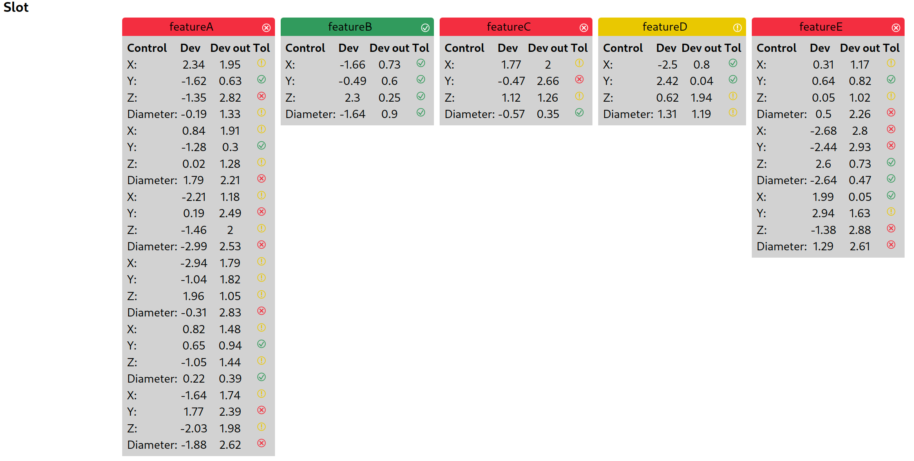

#  Parts metrology

## Backend

The backend will report the measurements in the following format: 

```json
{
    "slot/hole/seam": {
        "feature1/2/3": [{
            "x": {
                "deviation": number,
                "deviationTolerance": number
            },
            "y": {
                "deviation": number,
                "deviationTolerance": number
            },

            "z": {
                "deviation": number,
                "deviationTolerance": number
            },

            "diameter": {
                "deviation": number,
                "deviationTolerance": number
            }
        }]
    }
}
```

To run it, execute `run-backend.sh`

## Frontend

To run the frontend, execute `run-frontend.sh`.




# TODO

- `backend` Ask for a better explanation on tolerances, measurements, etc
- `frontend` Improve layout: probably using a flex grid
- `frontend` Fix fonts
- `frontend` Border radius on headers, white circle icon to the left, ellipsis at the bottom of the table
- `frontend` Match width of parts header and the display below so it stays aligned to the left
- `backend` Clarify parts production: Slot/Seam/Hole is that a stream of parts coming out or fixed categories
- Ask for where to deploy, pipeline policies, etc